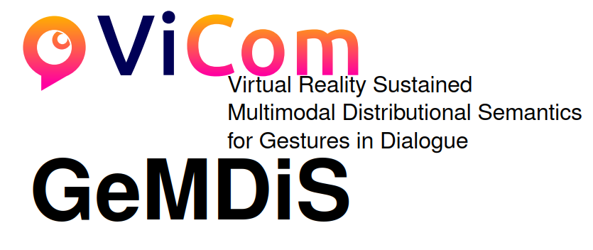

# ViCom

[ViCom](https://vicom.info/) (Visual Communication) - DFG Priority Programme 2392

> ViCom investigates the special features and linguistic significance of visual communication. This comprises sign languages as fully developed natural languages which exclusively rely on the visual channel for communication, but also visual means that enhance spoken language such as gestures. It aims at disclosing the specific characteristics of the visual modality as a communication channel and its interaction with other channels (especially the auditory channel) to develop a comprehensive theoretical linguistic model of human communication and its cognitive foundations.

## GeMDiS

[GeMDiS](https://vicom.info/projects/virtual-reality-sustained-multimodal-distributional-semantics-for-gestures-in-dialogue-gemdis/) (Virtual Reality Sustained Multimodal Distributional Semantics for Gestures in Dialogue) is part of ViCom.

{loading=lazy}